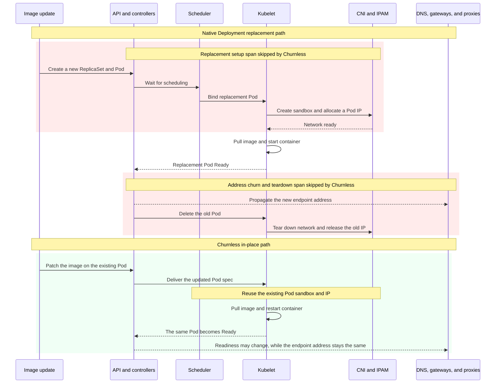

# Churnless

Keep Pod identity stable during supported in-place rollouts.

Churnless provides native-shaped Kubernetes `Deployment` and `ReplicaSet`
APIs that apply mutable metadata, images, and supported resources without
replacing healthy Pods. During a successful in-place rollout, Pod names, UIDs,
and IPs stay the same.

> [!IMPORTANT]
> Churnless is experimental and its API is `v1alpha1`. Test it carefully
> before using it for production workloads.

## Why

A native Kubernetes Deployment creates a new ReplicaSet whenever its Pod
template changes. An image rollout therefore creates replacement Pods and may
churn their IPs. Churnless treats supported metadata, images, and opted-in CPU
and memory changes as mutable revisions inside a ReplicaSet and patches the
existing Pods when Kubernetes permits it.

Stable Pod IPs also reduce the risk of control-plane propagation lag. In a
large cluster under pressure, components such as CoreDNS or Envoy Gateway may
observe Pod or EndpointSlice changes late. If a rollout replaces Pods and
changes their IPs faster than those updates propagate, data-plane clients can
temporarily resolve or route to stale addresses, causing lookup, connection,
or availability failures. In-place updates avoid unnecessary endpoint churn
and narrow that failure window.

### Where rollout time goes

A typical image-only RollingUpdate follows these paths. Exact ordering depends
on the rollout strategy, but a native rollout must establish replacement Pods;
a successful Churnless rollout keeps the existing Pod sandbox and network.



The red spans are replacement-only work that a successful Churnless rollout
skips: scheduling, Pod sandbox startup, CNI/IPAM allocation, endpoint-address
churn, network teardown, and IP release. Teardown may happen asynchronously
after a native rollout reports success. Image pull, container startup, and
readiness checks remain unshaded because both paths still pay those costs. The
benchmark below measures the end-to-end result rather than assigning fixed
durations to these cluster-dependent stages.

```text
Deployment.churnless.io
└── ReplicaSet.churnless.io
    └── Pod
```

Churnless uses no native Deployment or ReplicaSet shadow objects.

Highlights:

- `Deployment` and `ReplicaSet` under `churnless.io/v1alpha1`
- Native `apps/v1` specs and statuses embedded in the Go API
- In-place Pod-template label, annotation, and container image updates
- Opt-in best-effort regular-container CPU/memory resize
- RollingUpdate and Recreate for structural template changes
- Scaling, self-healing, Pod adoption, availability, and rollout status
- Standard `/scale` support for `kubectl scale` and HPA
- Upstream Kubernetes v1.36 workload defaulting and validation
- Kubebuilder-native manifests and an isolated kind test workflow

## Try it with kind

Prerequisites:

- Go
- Docker
- [kubectl](https://kubernetes.io/docs/tasks/tools/)
- [kind](https://kind.sigs.k8s.io/)

Create a local cluster, build and load the controller, install the CRDs, and
deploy a two-replica sample. The setup also installs pinned cert-manager and
Metrics Server releases for webhook and HPA testing:

```sh
make kind-up
```

Inspect the custom Deployment, its Churnless ReplicaSet, and the Pods:

```sh
make kind-status
```

Patch the sample image using the Churnless Deployment short name:

```sh
kubectl patch cdeploy deployment-sample \
  --type=merge \
  -p '{"spec":{"template":{"spec":{"containers":[{"name":"nginx","image":"nginx:1.28-alpine","ports":[{"containerPort":80}]}]}}}}'
```

Compare Pod identity before and after the rollout:

```sh
kubectl get pods -l app=deployment-sample \
  -o 'custom-columns=NAME:.metadata.name,UID:.metadata.uid,IP:.status.podIP,IMAGE:.spec.containers[0].image'
```

Opt a workload into best-effort CPU/memory resize:

```sh
kubectl annotate deployment.churnless.io/deployment-sample \
  churnless.io/in-place-resources=best-effort
```

If Kubernetes rejects a resize, Churnless replaces that Pod under the normal
rollout availability budget.

Explicitly replace every Pod even when the template is otherwise unchanged:

```sh
kubectl annotate deployment.churnless.io/deployment-sample \
  kubectl.kubernetes.io/restartedAt="$(date -u +%Y-%m-%dT%H:%M:%SZ)" --overwrite
```

The built-in `kubectl rollout restart` command cannot decode custom Deployment
GVKs. Churnless accepts its standard annotation key through generic
`kubectl annotate`; `churnless.io/redeploy-at` remains an equivalent alias.

Clean up:

```sh
make kind-down
```

## Use the API

For supported behavior, migrate a native manifest by changing its API version:

```yaml
apiVersion: churnless.io/v1alpha1
kind: Deployment
```

Use the distinct Churnless short names for interactive commands:

```sh
kubectl get cdeploy
kubectl get chrs
kubectl get churnless
kubectl scale cdeploy/deployment-sample --replicas=3
```

For scripts, use fully qualified resource names such as
`deployments.churnless.io` and `replicasets.churnless.io`.

HPA can target the Churnless GVK directly through its standard `/scale`
subresource.

## Design

See [DESIGN.md](DESIGN.md) for the compatibility contract, controller
responsibilities, revision model, invariants, known gaps, and required
acceptance tests.

## Development

The project was bootstrapped with Kubebuilder and follows its standard layout.

Run the local checks:

```sh
make manifests generate
make test
make lint
```

Run the isolated kind end-to-end suite:

```sh
make test-e2e
```

Compare image-only rollouts with native Deployments on a dedicated kind
cluster. The default run uses 100 replicas, three alternating image rollouts,
and preloaded images so registry latency is outside the measurement:

```sh
make benchmark-rollout
make benchmark-rollout-cleanup
```

Override `BENCHMARK_REPLICAS` and `BENCHMARK_ITERATIONS` for larger or longer
runs. The benchmark fails if either rollout violates its surge/availability
budget or if Pod identity behavior differs from the expected native and
Churnless models.

## Contributing

Issues and pull requests are welcome. Please include tests for behavior
changes and keep [the design contract](DESIGN.md) current.

## License

Licensed under the [Apache License 2.0](LICENSE).
